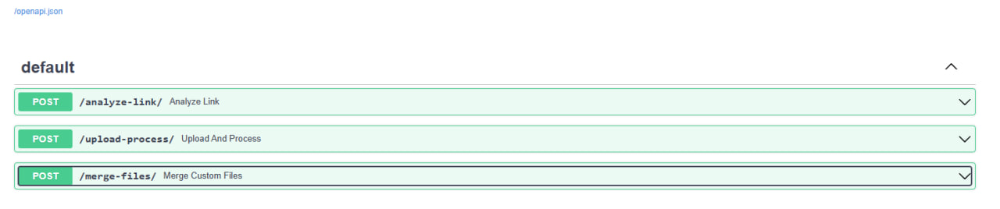
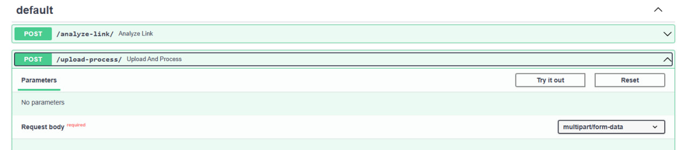
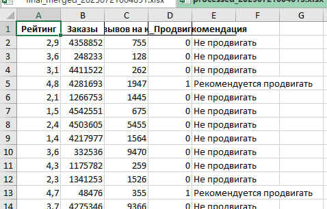
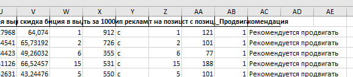

# WB Backend Part (FastAPI)

## Описание

- Объединяет несколько Excel-таблиц (аналитика, бренды, категории и т.д.)
- Применяет ML-модель, чтобы предсказать, стоит ли продвигать товар
- Обрабатывает отдельные Excel-файлы
- Принимает ссылки на карточки товаров и возвращает рекомендации
- Возвращает обработанные Excel-таблицы с колонкой **"Рекомендация"**

---

## Используемые технологии

- Python 3.10+
- FastAPI
- Pandas
- Scikit-learn (RandomForestClassifier)
- Joblib (для сохранения/загрузки модели)
- Uvicorn
- Excel-файлы (.xlsx)

---

## Структура проекта

```

.
├── server.py                                   # Основной backend-сервер (FastAPI)
├── create_model.py                             # Скрипт для обучения и сохранения ML-модели
├── model.pkl                                   # Обученная модель (создаётся после запуска create\_model.py)
├── uploads/                                    # Папка для загруженных файлов
├── processed/                                  # Папка для сохранённых результатов
├── Папки с входными Excel файлами/             # Папка для сохранённых результатов
├── requirements.txt                            # Зависимости

````

---

## Установка зависимостей

```bash
pip install -r requirements.txt
````

---

## Обучение ML-модели

Перед запуском сервера необходимо обучить модель:

```bash
python create_model.py
```

Это создаст файл `model.pkl`, который будет автоматически загружен сервером.

---

## Запуск сервера

```bash
uvicorn server:app --reload
```

Сервер будет доступен по адресу: [http://localhost:8000](http://localhost:8000)
Документация API (Swagger): [http://localhost:8000/docs](http://localhost:8000/docs)

Необходимо выбрать нужный эндпоинт


Нажать `Try it out` и загрузить нужные файлы или ссылку

---

## Поддерживаемые маршруты (эндпоинты)

### 1. `POST /upload-process/`

Загрузка одного Excel-файла → Обработка → Возврат Excel-файла с рекомендациями

* Поле формы: `file` (Excel-файл)

---

### 2. `POST /merge-files/`

Загрузка нескольких Excel-файлов → Объединение по ключам → Прогнозирование → Возврат финальной таблицы

* Поля формы:

  * `products`
  * `brands`
  * `suppliers`
  * `categories`
  * `trends`
  * `ads`
  * `seasonality`

Файлы должны быть в формате `.xlsx` и соответствовать ожиданиям по структуре.

---

### 3. `POST /analyze-link/`

Принимает ссылку на товар (например, с Wildberries), извлекает артикул, генерирует фиктивные данные и возвращает прогноз.
